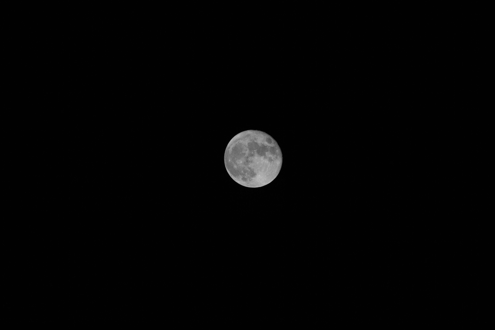

# Desaturate

Python script to automatically desaturate an image. Currently only supports RGB images.

## Usage

Download [desaturate.py](desaturate.py) and import the `process` method.

Syntax is as following:
`process(image_path)`

The script will automatically save the desaturated image with the same name as the original except with a "_desaturated" appended to the end of the name.

To recursively process an entire folder import the `process_folder` method.

## Example

Moon (before)

Moon (after)

## Work In Progress

1. Add support for other image modes.